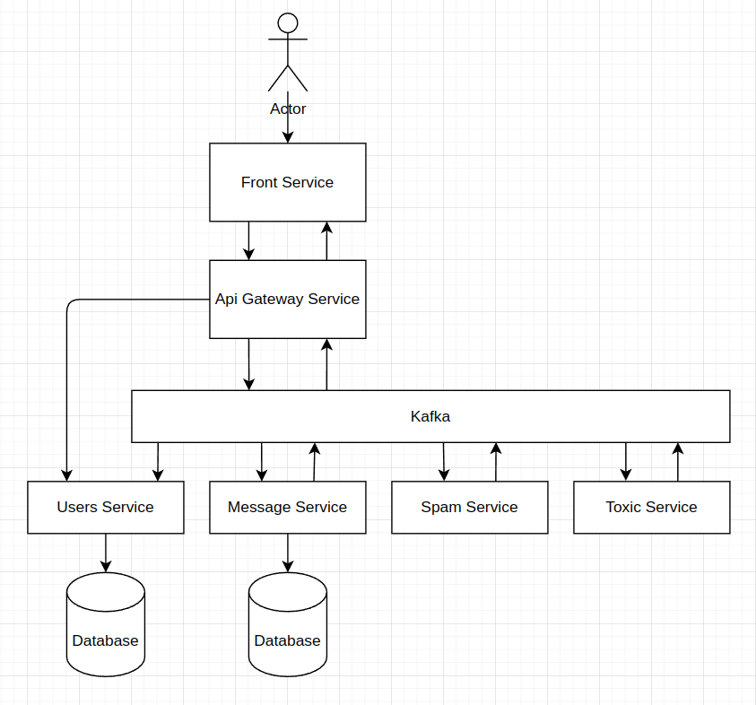
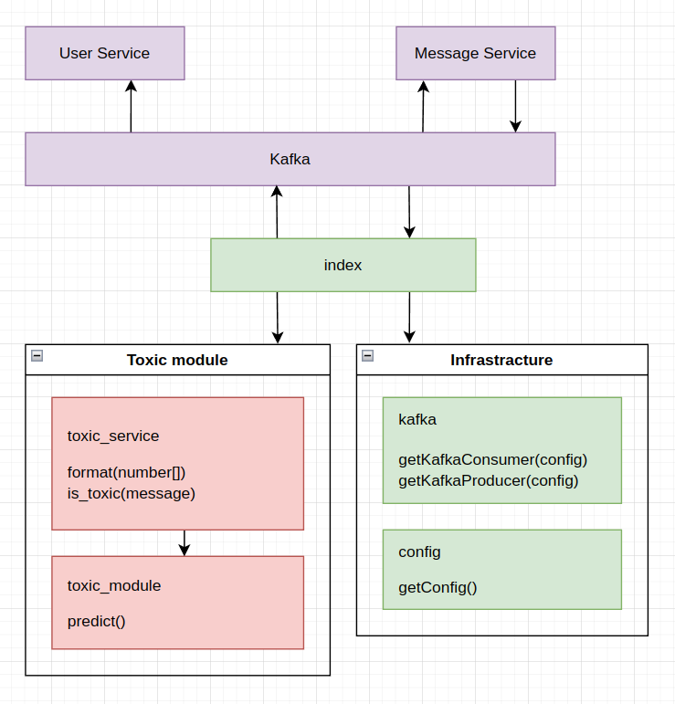
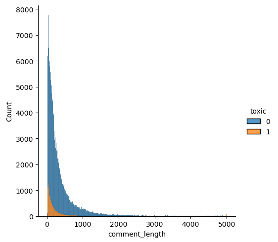
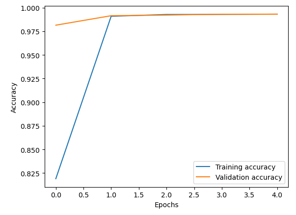

## Microservices for beginners. Toxic service. Python. Tensorflow. Kafka.

Toxic service provides analysis of toxic and obscene messages. I use a publish-subscribe pattern through Kafka message broker. And Recurrent Neural Network (RNN) model for text analysis.

Full code - [link](https://github.com/Igorok/micro-toxic)

### Whole scheme:



Short description:

- User opens the front-end application in the browser and writes messages.
- Front-end service emits messages to the api gateway through socket.io.
- Api gateway emits messages in the Kafka topic for new messages.
- Message service subscribes to the topic with new messages, saves them and publishes events into the topic for saved messages.
- Users in the front-end service receive messages in the browser from the Api gateway.
- Toxic service subscribes to the Kafka topic with saved messages. Tensorflow model analyzes messages. Messages which were predicted as toxic do publish into the Kafka topic for analyzed messages.
- Message and User services listen to events with spam and toxic messages, mark them in the database, and apply domain logic after receiving these events.

### Scheme of toxic service:



`src/index.py` - this file contains initialization of the service. `src/index.py` - this file contains initialization of the service. `main` function gets configuration, connects to Kafka consumer and producer, and provides publish-subscribe events.

```python
from infrastructure.config import getConfig
from toxic_module.toxic_service import ToxicService
from infrastructure.kafka import getKafkaConsumer, getKafkaProducer


def main():
    config = getConfig()
    consumer = getKafkaConsumer(config)
    producer = getKafkaProducer(config)
    toxic_service = ToxicService()

    print('toxic-service started')

    for message in consumer:
        try:
            if not message.value.get('message'):
                continue

            prediction = toxic_service.is_toxic(message.value.get('message'))
            if prediction['is_toxic']:
                response = {
                    'id': message.value.get('id'),
                    'user_id': message.value.get('user_id'),
                    'analysis': prediction['prediction']
                }
                producer.send(config['KAFKA_ANALYSIS_MESSAGE_TOPIC'], response)

        except Exception as error:
            print('error', error)


if __name__ == '__main__':
    main()
```

`src/infrastructure/config.py` - this is the infrastructure helper, provides configuration for service.
```python
import os
from dotenv import dotenv_values


def getConfig():
    config = {
        **dotenv_values('./config/.env.dev'),  # load shared development variables
        **dotenv_values('./config/.env.prod'),  # load sensitive variables
        **os.environ,  # override loaded values with environment variables
    }
    return {
        'KAFKA_URI': config['KAFKA_URI'],
        'KAFKA_READY_MESSAGE_TOPIC': config.get('KAFKA_READY_MESSAGE_TOPIC'),
        'KAFKA_READY_MESSAGE_GROUP': config.get('KAFKA_READY_MESSAGE_GROUP'),
        'KAFKA_ANALYSIS_MESSAGE_TOPIC': config.get('KAFKA_ANALYSIS_MESSAGE_TOPIC'),
        'KAFKA_ANALYSIS_MESSAGE_GROUP': config.get('KAFKA_ANALYSIS_MESSAGE_GROUP'),
    }
```

`src/infrastructure/kafka.py` -this is the infrastructure helper, provides connection to Kafka.
```python
import json
from kafka import KafkaConsumer
from kafka import KafkaProducer


def getKafkaConsumer(config):
    return KafkaConsumer(
        config['KAFKA_READY_MESSAGE_TOPIC'],
        group_id=config['KAFKA_READY_MESSAGE_GROUP'],
        bootstrap_servers=[config['KAFKA_URI']],
        value_deserializer=lambda m: json.loads(m.decode('utf-8')),
    )

def getKafkaProducer(config):
    return KafkaProducer(
        bootstrap_servers=[config['KAFKA_URI']],
        value_serializer=lambda v: json.dumps(v).encode('utf-8')
    )
```

`src/toxic_module/toxic_service.py` - this file provides application logic. Here located functionality for message prediction by neural network.
```python
import os
os.environ['TF_CPP_MIN_LOG_LEVEL'] = '2'
from tensorflow.keras.models import load_model

class ToxicService:
    empty_message = 'Empty message!'
    model_path = './src/toxic_module/toxic_model_lstm'

    def __init__(self):
        self.model = load_model(self.model_path)

    def format(self, prediction):
        keys = ['toxic','severe_toxic', 'obscene', 'threat', 'insult', 'identity_hate']
        return dict(zip(keys, prediction))

    def is_toxic(self, message):
        [prediction] = self.model.predict([message])
        prediction = [bool(round(value)) for value in prediction]

        return {
            'is_toxic': any(prediction),
            'prediction': self.format(prediction),
        }
```

### Model

Model for multi-label prediction of [toxic comments](https://www.kaggle.com/datasets/julian3833/jigsaw-toxic-comment-classification-challenge?datasetId=1709138), these may be toxic, severe_toxic, obscene, threat, insult, identity_hate.

```python
import numpy as np
import pandas as pd
import matplotlib.pyplot as plt
from tensorflow.keras import utils
from tensorflow.keras.models import Sequential
from tensorflow.keras.layers import Dense, Embedding, MaxPooling1D, Dropout, LSTM, Bidirectional, SpatialDropout1D, TextVectorization
from tensorflow.keras.callbacks import ModelCheckpoint
from tensorflow.keras.models import load_model
```

Train data contain text and labels with answers.
```python
train_data = pd.read_csv('/kaggle/input/jigsaw-toxic-comment-classification-challenge/train.csv',index_col='id')
train_data.head()
```

We need to found which length of message we will analyse for prediction
```python
train_data['comment_length'] = train_data['comment_text'].apply(lambda row: len(row))
train_data.head()
```

```python
import seaborn as sns
sns.displot(
    data=train_data,
    x="comment_length",
    hue='toxic',
    multiple="stack",
)
```


Length of toxic comments: max 5000, min 8, mean 295.24604420034, median 123.0, 75% 271.0.
```python
print(
    'max', toxic_data['comment_length'].max(),
    'min', toxic_data['comment_length'].min(),
    'mean', toxic_data['comment_length'].mean(),
    'median', toxic_data['comment_length'].median(),
    '75%', toxic_data['comment_length'].quantile(0.75),
)
```

So 300 symbols should be enough.
```python
max_comment_len = 300
```

Test data contain two files with text and labels separately.
```python
test_data = pd.read_csv('/kaggle/input/jigsaw-toxic-comment-classification-challenge/test.csv',index_col='id')
test_data.head()
```

```python
test_labels_data = pd.read_csv('/kaggle/input/jigsaw-toxic-comment-classification-challenge/test_labels.csv',index_col='id')
test_labels_data.head()
```

And some labels has value of -1, that indicates it was not used for scoring; (Note: file added after competition close!)
```python
test_data = test_data.join(test_labels_data)
test_data = test_data[test_data['toxic'] != -1]
test_data.head()
```

I used solution from "Toxic Comment Classification Challenge" on base of RNN, which takes  [3rd place](https://www.kaggle.com/c/jigsaw-toxic-comment-classification-challenge/discussion/52644). My notebook [here](https://www.kaggle.com/code/igordubinin/toxic-comments).

Neural networks this is a series of algorithms that seek to identify relationships in a data without being explicitly programmed.

Neural networks works with numbers, so we need convert messages to numbers.

TextVectorization - A preprocessing layer which maps text features to integer sequences.

max_tokens - Maximum size of the vocabulary for this layer.

adapt - Computes a vocabulary of string terms from tokens in a dataset.

encoder - this is vocabulary created on base of training messages, this is first layer of network that convert coming messages into list of numbers.

Embeding - turns positive integers (indexes) into dense vectors of fixed size. Dense vectors this is modern kind of representing words as vector, this solution have famose effect: King - Man + Woman = Queen.

SpatialDropout1D - dropout, however, it drops entire 1D feature maps instead of individual elements. Dropout removes some neurons from network, this solution help to avoid overfitting.

LSTM - Long Short-Term Memory layer, this is kind of Recurrent Neural Network. return_sequences - whether to return the last output in the output sequence, or the full sequence.

Dense - densely-connected NN layer. Final layer that contain 6 neurons with result.

```python
num_words = 10000
encoder = TextVectorization(max_tokens=num_words)
encoder.adapt(train_data['comment_text'].values)

model_lstm = Sequential([
    encoder,
    Embedding(
        input_dim=len(encoder.get_vocabulary()),
        output_dim=128,
        mask_zero=True,
        input_length=max_comment_len,
    ),
    SpatialDropout1D(0.5),
    LSTM(40, return_sequences=True),
    LSTM(40),
    Dense(6, activation='sigmoid'),
])
```

Training of neural network this is a process which reduce difference between correct result and result of neural network. NN reduce error by [gradient descent](https://developers.google.com/machine-learning/crash-course/reducing-loss/gradient-descent).

Loss function - a mesure for difference between real and prediction values. There are different [loss functions](https://kitchell.github.io/DeepLearningTutorial/7lossfunctionsoptimizers.html):
binary crossentropy,
categorical crossentropy,
mean squared error.

Gradient descent have [different optimizations](https://www.geeksforgeeks.org/optimization-techniques-for-gradient-descent/):
SGD,
Adam,
Momentum,
AdaGrad.

```python
model_lstm.compile(optimizer='adam', loss='binary_crossentropy', metrics=['accuracy', 'AUC'])
```

[ModelCheckpoint](https://keras.io/api/callbacks/model_checkpoint/) callback is used in conjunction with training using model.fit() to save a model or weights (in a checkpoint file) at some interval, so the model or weights can be loaded later to continue the training from the state saved.

```python
model_lstm_save_path = '/kaggle/working/toxic_model_lstm'
checkpoint_callback_lstm = ModelCheckpoint(
    model_lstm_save_path,
    monitor='val_accuracy',
    save_best_only=True,
    verbose=1,
    save_format='tf',
)
```

Get data for training
```python
x_train = train_data['comment_text'].values
y_train = train_data[['toxic', 'severe_toxic', 'obscene', 'threat', 'insult', 'identity_hate']].values
```

Fit of the model
```python
history_lstm = model_lstm.fit(
    x_train,
    y_train,
    epochs=5, # 15
    batch_size=512,
    validation_split=0.2,
    callbacks=[checkpoint_callback_lstm],
)
```

Result of training
```python
plt.plot(history_lstm.history['accuracy'],
         label='Training accuracy')
plt.plot(history_lstm.history['val_accuracy'],
         label='Validation accuracy')
plt.xlabel('Epochs')
plt.ylabel('Accuracy')
plt.legend()
plt.show()
```



Get data for testing
```python
x_test = test_data['comment_text'].values
y_test = test_data[['toxic', 'severe_toxic', 'obscene', 'threat', 'insult', 'identity_hate']].values
```

Check result
```python
model_lstm.evaluate(x_test, y_test, verbose=1)
```

Check result of saved model
```python
saved_model = load_model(model_lstm_save_path)
saved_model.evaluate(x_test, y_test, verbose=1)
```

Compress model
```
!zip -r /kaggle/working/toxic_model_lstm.zip /kaggle/working/toxic_model_lstm
```

Check model with production data
```python
quotes = [
    "It takes a great deal of bravery to stand up to your enemies, but a great deal more to stand up to your friends.",
    "No, no. This kind of mark cannot be seen. It lives in your very skin… Love, Harry. Love.",
    "I would trust Hagrid with my own life.",
    "Also, our caretaker, Mr. Filch, has asked me to remind you that the third-floor corridor on the right-hand side is out of bounds to everyone who does not wish to die a most painful death.",
    "It is not our abilities that show what we truly are. It is our choices.",
]
not_toxic_prediction = saved_model.predict(quotes)
for labels in not_toxic_prediction:
    print([ round(lbl, 2) for lbl in labels])
```

```python
quotes = [
    "Maybe If The Fat Lump Had Given This A Squeeze, He'd Have Remembered To Fall On His Fat Ass.",
    "No One Asked Your Opinion, You Filthy Little Mudblood.",
    "Didn't Mummy Ever Tell You It Was Rude To Eavesdrop, Potter? Oh, Yeah. She Was Dead Before You Could Wipe The Drool Off Your Chin.",
    "You're Gonna Regret This! You And Your Bloody Chicken!",
    "I'm going to kill you, Harry Potter. I'm going to destroy you.",
]
toxic_prediction = saved_model.predict(quotes)
for labels in toxic_prediction:
    print([ round(lbl, 2) for lbl in labels])
```

Sources:

[ALEXANDER BURMISTROV - About my 0.9872 single model](https://www.kaggle.com/c/jigsaw-toxic-comment-classification-challenge/discussion/52644)

### Instalation

Python venv

```
python3 -m venv .venv
source .venv/bin/activate
```

Install packages

```
pip install -e .
```

Testing
```
python -m unittest
```

Launch
```
python src/index.py
```
